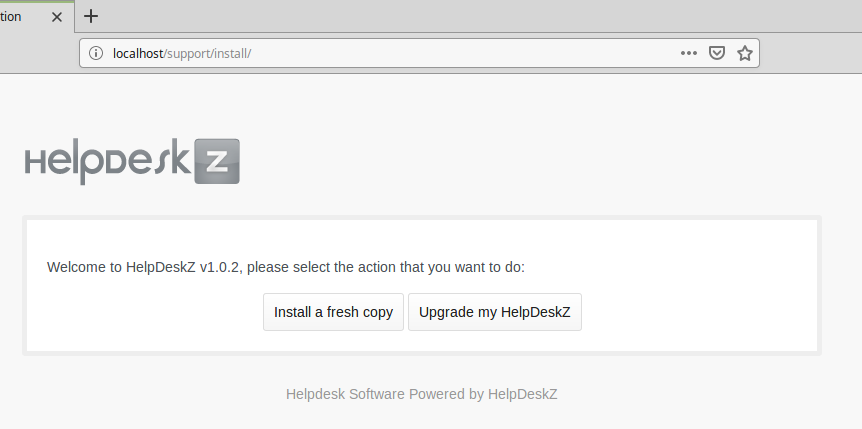
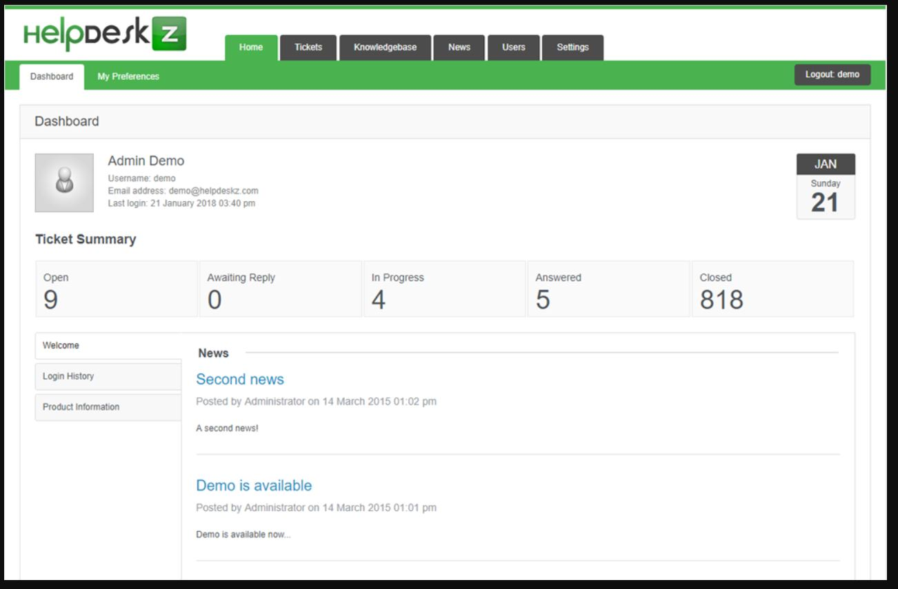

# HelpDeskZ
Trabajo IDP - HelpDeskZ

## Índice

* [Definición](#definición)
* [Requisitos](#requisitos)
* [Características](#características)
* [Interfaz](#interfaz)
* [Instalación](#instalación)
* [Investigación](#investigación)
* [Conclusión](#conclusión)

## Definición

HelpDeskZ es una software gratuito de código libre basado en PHP que permite manejar el soporte de tu sitio web usando el sistema de soporte de tickets.

## Requisitos

- PHP 5.x
- MySQL database

## Características

- Categorización de grupos

- Respuestas automatizadas
 
- Campos personalizados

- Acciones en bloque

- Login Share

- Sección de noticias

- Multilenguaje

- Crear o responder tickets vía e-mail

- Facil personalización de plantillas

- Niveles de prioridad para los tickets
 
- Notificaciones de email
 
- Prevención de SPAM
 
 

## Interfaz

La herramienta cuenta con diferentes interfaces:

- Cliente
Es la interfaz de los clientes. En ella pueden publicar nuevas solicitudes, ver tickets existentes o leer artículos de la base de conocimientos.

- Administrador
Interfaz en la que se gestiona los tickets de los clientes, personaliza las configuraciones y administra funciones.

- Base de conocimiento
Es una base que está compuesta de distintos artículos organizados según su tipología. Es de utilidad ya que reduce el número de solicitudes de ayuda por parte del cliente.

## Instalación

Para instalar la herramienta HelpDeskz, primero debemos instalar Apache, MySQL y PHP. 
Abrimos un terminal e instalamos dichos paquetes desde los repositorios en un Linux Mint 18.3.

`sudo apt-get install apache2`
`sudo apt-get install php libapache2-mod-php php-mcrypt php-mysql`
`apt-get install mysql-server mysql-client`

1. Descargar la herramienta desde la página oficial de HelpDeskZ. [Descargar](https://www.helpdeskz.com/download)

2. Ir a */var/www/html* y crear una carpeta llamada "support" donde se instalará HelpDeskZ.

3. Copiar el zip descargado en la carpeta "support" y descomprimirlo.

4. Abrir el navegador y acceder a *http://localhost/support/install/*. Con esto se ejecutará el script de configuración de HelpDeskZ.

- Elegir "Install a fresh copy".

- Rellenar los campos para la configuración de la base de datos y el acceso a la herramienta.

    
Una vez hecho esto, la instalación debería haberse completado y podríamos acceder a la herramienta. 

En mi caso, la pantalla de instalación se quedó en blanco y la herramienta no se instaló.

Esto probablemente es debido a que el programa está en desuso y desde el año 2017 no lo actualizan.

## Investigación

Si hacemos una búsqueda por internet, podemos comprobar que hay poca información sobre esta herramienta, lo que dificulta poder corregir el error de instalación. 

Solamente encontré una página que describa los errores del software aunque no publica la solución de dicho error. [GitHub](https://github.com/evolutionscript/HelpDeskZ-1.0)

## Conclusión

En su año de salida (2015) y posteriores, hasta que el proyecto fue abandonado, tenía buenas críticas ya que, sus diferentes interfaces lo hacía un programa completo y fácil de usar.

Posteriormente, al dejar de ser actualizado, perdió su usabilidad. Además, si accedemos a su página web podremos comprobar que la mayoría de las pestañas de la barra de navegación no funcionan, por lo que hace aún más que la herramienta no sea adecuada para su uso.

*Adjunto varias imágenes de su interfaz*

